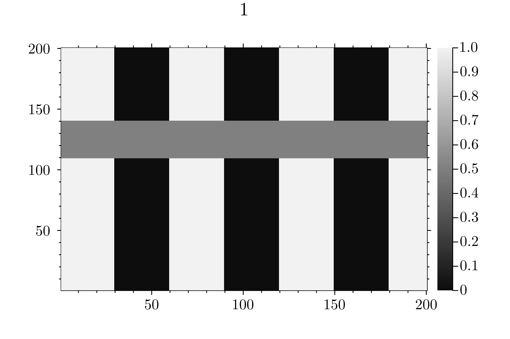
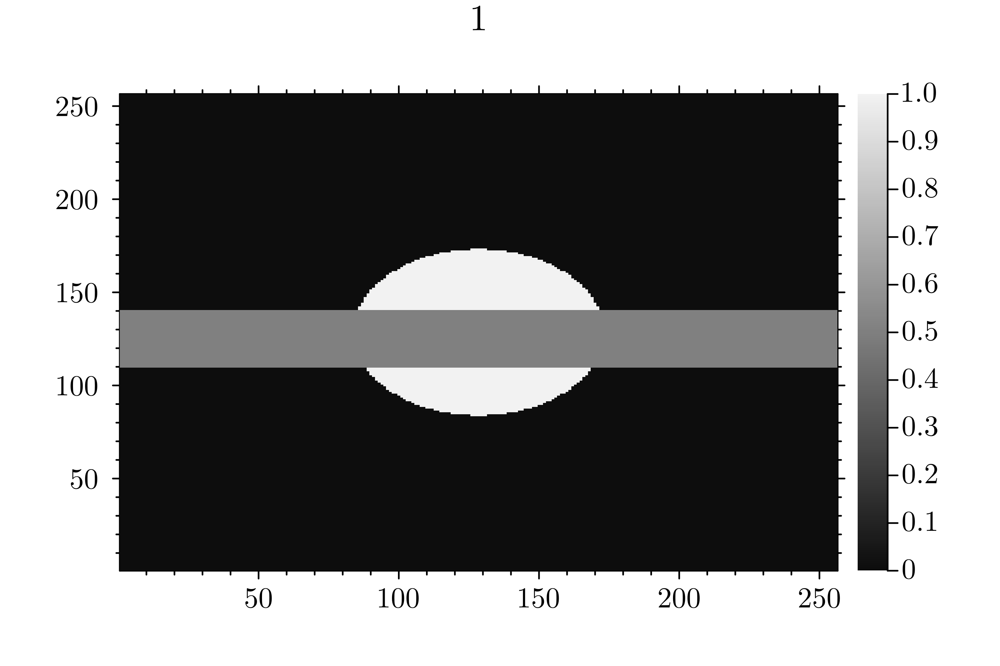
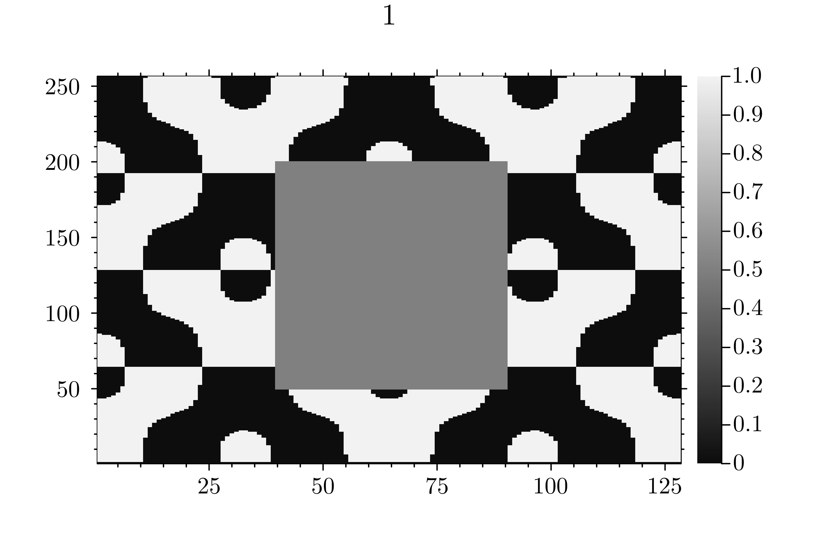

### Example of image inpainting

<h3 align="center">Comparison of Methods</h3>

<table align="center">
<tr>
<td align="center">

<b>Gradient Flow</b> 

</td>

<td align="center">

<b>Momentum Flow</b> 
    

</td>
</tr>

</table>

<table align="center">
<tr>
<td align="center">

<b>Gradient Flow</b> 

</td>

<td align="center">

<b>Momentum Flow</b> 
    

</td>
</tr>
</table>

</table>

<table align="center">
<tr>
<td align="center">

<b>Gradient Flow</b> 

</td>

<td align="center">

<b>Momentum Flow</b> 
    

</td>
</tr>
</table>